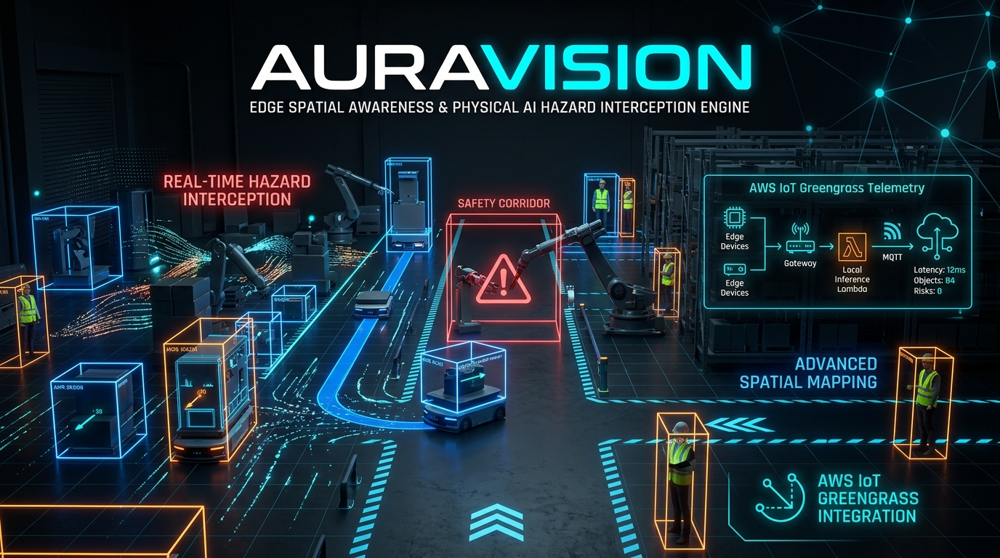

# AuraVision 👁️⚡
### Edge Spatial Awareness & Physical AI Hazard Interception Engine



[](https://auravision-spatial.vercel.app)
[](LICENSE)
[](https://opencv.org)
[](https://aws.amazon.com/iot-greengrass/)

---

## 🎯 Executive Overview & Mission

In high-density industrial automation, robotic manufacturing plants, and human-robot collaborative cells, automated guided vehicles (AGVs) and autonomous mobile robots (AMRs) operate in close proximity to human workers. Conventional vision stacks suffer from:
1. **High latency cloud round-trips** (50-200ms), making collision avoidance impossible at operational speeds.
2. **2D-only bounding boxes** that lack depth velocity and 3D trajectory forecasting.
3. **Fragile network dependencies** in radio-shadowed factory floors.

**AuraVision** is an open-source, edge-native spatial awareness engine powered by **OpenCV 5** and **AWS IoT Greengrass**. It calculates 3D optical flow vector fields, predicts millisecond-accurate **Time-To-Collision (TTC)** along dynamic safety corridors, and triggers autonomous emergency braking and AWS IoT hazard alerts at sub-4ms edge latencies.

---

## 🔬 System Architecture

```
                       ┌──────────────────────────────┐
                       │ High-Speed Edge Camera Stream│
                       │   (60-120 FPS Sensor Feed)   │
                       └──────────────┬───────────────┘
                                      │
                                      ▼
             ┌──────────────────────────────────────────────────┐
             │       OPENCV 5 EDGE SPATIAL ENGINE CORE          │
             └────────┬─────────────────┬────────────────┬──────┘
                      │                 │                │
     ┌────────────────┴──────┐  ┌───────┴──────┐  ┌──────┴───────────────┐
     │ 3D Optical Flow Field │  │ Depth Vector │  │ Bounding Frustum     │
     │ Pyramidal Calculation │  │ Kinematics   │  │ Spatial Projection   │
     └────────────────┬──────┘  └───────┬──────┘  └──────┬───────────────┘
                      │                 │                │
                      └────────┬────────┴────────┬───────┘
                               ▼                 ▼
                   ┌────────────────────────┐  ┌─────────────────────────┐
                   │ Dynamic Safety Corridor│  │ Time-To-Collision (TTC) │
                   │ Lateral Intersection   │  │ Kinematic Forecaster    │
                   └───────────┬────────────┘  └───────────┬─────────────┘
                               │                           │
                               └─────────────┬─────────────┘
                                             ▼
                   ┌──────────────────────────────────────────────┐
                   │ Autonomous Interception & AWS Greengrass     │
                   │  • Sub-1.2s TTC Emergency Brake Trigger      │
                   │  • Binary Telemetry Sync (QoS 0/1)           │
                   │  • 3D Spatial Radar Canvas Viewport          │
                   └──────────────────────────────────────────────┘
```

### 1. Zero-Latency Kinematic Trajectory Prediction
AuraVision tracks objects in 3D coordinate space $(X, Y, Z, \dot{X}, \dot{Y}, \dot{Z})$ to compute real-time lateral safety corridor intersections. If approaching velocity $V_z$ projects a Time-To-Collision $\le 1.2\text{s}$, the system immediately fires an autonomous emergency deceleration event.

### 2. AWS IoT Greengrass Edge Dispatch
Synchronizes critical event payloads to AWS IoT Core over low-bandwidth MQTT topics (`auravision/edge/hazards/critical`) with QoS 1 guarantees and automatic local queueing during temporary uplink dropouts.

---

## 🚀 Quickstart & Field CLI

### 1. Run Deterministic Test Suite
```bash
git clone https://github.com/Naveen57990/AuraVision.git
cd AuraVision

# Execute 8/8 comprehensive deterministic unit tests
python3 -m unittest auravision/engine/test_auravision.py
```

### 2. Tactical Field CLI Simulation
```bash
# Run interactive multi-scenario edge stream benchmark
python3 auravision/cli/auravision.py --demo

# Test a custom kinematic vector
python3 auravision/cli/auravision.py --x 0.1 --z 4.5 --vx -0.2 --vz -5.0
```

### 3. Production Web Console
Visit the live deployment at [https://auravision-spatial.vercel.app](https://auravision-spatial.vercel.app).

---

## 📊 Deterministic Test Verification

```text
Ran 8 tests in 0.000s

OK
- test_imminent_head_on_collision_critical_ttc ..... PASSED
- test_moderate_approaching_warning_ttc ............ PASSED
- test_distant_approaching_advisory_ttc ............ PASSED
- test_receding_object_is_clear .................... PASSED
- test_divergent_trajectory_missing_lateral_corridor PASSED
- test_multi_object_frame_telemetry_aggregation .... PASSED
- test_aws_iot_edge_dispatcher_serialization ....... PASSED
- test_stationary_proximity_warning ................ PASSED
```

---

## 🛡️ License
Licensed under the open-source [MIT License](LICENSE). Built for physical AI, industrial robotics, and worker safety worldwide.
